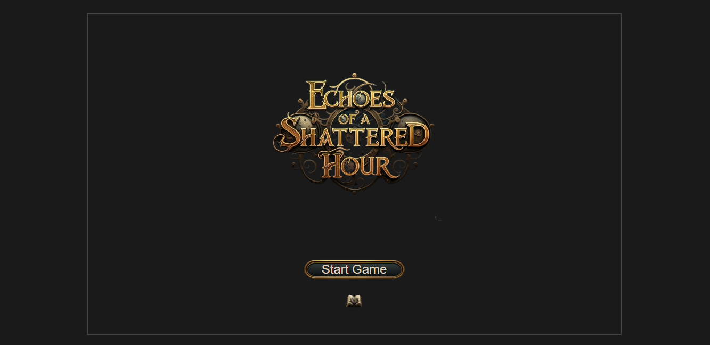

# Echoes of a Shattered Hour

 <!-- Optional: Add a nice screenshot or promotional image -->

A captivating visual novel where choices unravel a temporal mystery. Guide Aria as she discovers an ancient artifact, encounters enigmatic allies and foes, and navigates the echoes of a fractured timeline.

**Play the game live on GitHub Pages:** [https://gnurtuv.github.io/echoes-of-a-shattered-hour/]

## Table of Contents

- [Story](#story)
- [Features](#features)
- [How to Play](#how-to-play)
- [Technology Stack](#technology-stack)
- [Project Structure](#project-structure)
- [Setup for Local Development](#setup-for-local-development)
- [Future Development / To-Do](#future-development--to-do)
- [Contributing](#contributing)

## Story

Aria, a curious young woman from a secluded village, stumbles upon a pulsating fragment, an echo from a forgotten era. Its discovery awakens dormant temporal energies, drawing forth Lysander, a mysterious guardian from a different time, and catching the attention of the shadowy Warden, a figure who seems to manipulate the very fabric of time.

Caught between ancient prophecies and fractured timelines, Aria must navigate treacherous paths, make difficult choices, and uncover the secrets of the shattered Hourglass. Will she mend what is broken, or will she and her world be lost to the echoes of a shattered hour?

## Features

*   **Branching Narrative:** Your choices directly impact the story and lead to multiple endings.
*   **Compelling Characters:** Meet Aria, the determined protagonist, the enigmatic Lysander, the wise Elara Thorne, and the formidable Warden.
*   **Rich World & Lore:** Explore various locations, from ancient estates and quiet villages to mysterious temporal anomalies.
*   **Inventory System:** Collect clues and key items that influence your path. (no items for now)
*   **Flag-Based Progression:** Internal game flags track your decisions, shaping dialogue and available actions.
*   **Custom UI & Artwork:** Enjoy original character art, backgrounds, and CGs that bring the story to life.
*   **Save/Load System:** Pick up your adventure where you left off.
*   **Typewriter Text Effect:** Classic visual novel text display.
*   **Interactive Choices:** Engage directly with the story by making decisions for Aria.

## How to Play

1.  Visit the live game link: [https://gnurtuv.github.io/echoes-of-a-shattered-hour/]
2.  Click "**Start Game**" to begin a new adventure or "**Load Game**" to continue.
3.  Read the story and dialogue presented.
4.  When choices appear, click on the option you want Aria to take.
5.  Click the "**Next**" button (or the dialogue box itself) to advance text.
6.  Use the in-game **Menu** (settings icon) to Save, Load, or Quit to Title.
7.  Check your **Inventory** via the menu to see collected items.

## Technology Stack

*   **HTML5:** Structure of the game.
*   **CSS3:** Styling and presentation, including animations and transitions.
*   **JavaScript (ES6+):** Core game logic, story engine, and interactivity.
*   **GitHub Pages:** Hosting for the live version of the game.
*   **Art Assets:** Original artwork created by AI.

## Project Structure

```bash
├── index.html # Main game page
├── style.css # Styles for the game
├── script.js # Core game logic and story engine
└── assets/
├── img/
│ ├── backgrounds/ # Background images
│ ├── cgs/ # Cutscene Graphics
│ ├── characters/ # Character sprites (Aria, Elara, Lysander, Warden)
│ └── ui/ # User interface elements (icons, frames, titles)
```

## Setup for Local Development

1.  Clone the repository:
    ```bash
    https://github.com/gnurtuv/echoes-of-a-shattered-hour.git
    ```
2.  Navigate to the project directory:
    ```bash
    cd echoes-of-a-shattered-hour
    ```
3.  Open `index.html` in a modern web browser.
    *   (Optional: For best results with local file access and to avoid potential browser security restrictions, running a simple local web server is recommended. Python example: `python -m http.server`)

## Future Development / To-Do

*   [ ] Complete implementation of Act 2 and Act 3 storyline.
*   [ ] Add more conditional branches based on player choices and inventory.
*   [ ] Implement [Affection System, more complex puzzles].
*   [ ] Add sound effects and background music.
*   [ ] Further UI polish and custom font integration.
*   [ ] Additional character expressions and poses.
*   [ ] Multiple save slots.

## Contributing

Contributions are welcome! If you have ideas for improvements, new story branches, or bug fixes, please feel free to:

1.  Fork the repository.
2.  Create a new branch (`git checkout -b feature/YourFeature` or `bugfix/YourBugfix`).
3.  Make your changes.
4.  Commit your changes (`git commit -m 'Add some feature'`).
5.  Push to the branch (`git push origin feature/YourFeature`).
6.  Open a Pull Request.

Please ensure your code adheres to the existing style and that any new story content aligns with the established tone and lore.

---
